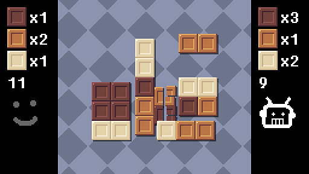

# Chocutlate
A dots-and-boxes-like two-player strategy game. Play with a bot or your friend!

Made for [LÖVE Jam 2021](https://itch.io/jam/love2d-jam-2021).

## Game Rule
- The game starts with a chunk of chocolate consisting of 5x6 pieces.
- Each turn, player can pick one chunk and *CUT* it into two chunks.
- If the cut chunk consists of different kinds of pieces, take the pieces.
- The first player to collect 15 pieces wins the game.

## Control
- mouse1 : Cut
- r : Reset
- esc : Go to main menu

## Credit
- [love.js](https://github.com/Davidobot/love.js)
- [binser](https://github.com/bakpakin/binser)
- [cargo](https://github.com/bjornbytes/cargo)
- [lovebird](https://github.com/rxi/lovebird), [lurker](https://github.com/rxi/lurker)
- [middleclass](https://github.com/kikito/middleclass)
- [hump.timer](https://hump.readthedocs.io/en/latest/timer.html)
